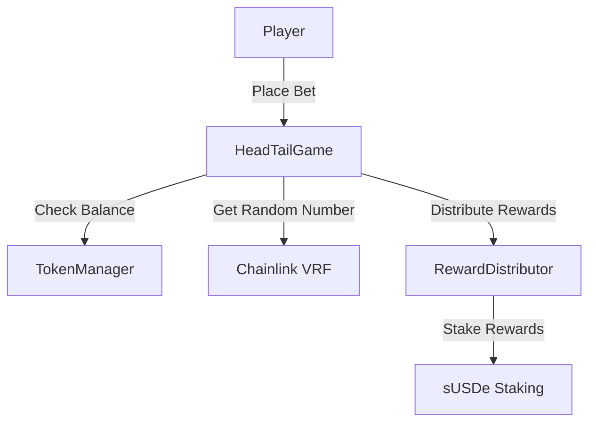

# 🔐 Smart Contract Documentation

## Quick Links
- 🌐 [Live Demo](https://ethenafun.vercel.app/)
- 📂 [GitHub Repository](https://github.com/arpit3210/ethenafun)
- 📚 [Back to Main Documentation](../README.md)

## Contract Addresses
- **Mainnet**: [Coming Soon]
- **Testnet**: [Coming Soon]

## Smart Contract Architecture

### Core Contracts
1. **HeadTailGame.sol**
   - Main game logic
   - Bet placement and resolution
   - Random number generation
   - Event emission

2. **TokenManager.sol**
   - USDe token integration
   - Balance management
   - Fee collection

3. **RewardDistributor.sol**
   - sUSDe staking rewards
   - Winner payment processing
   - Fee distribution

### Contract Interactions


## Key Functions

### HeadTailGame.sol
```solidity
function placeBet(uint256 amount, bool isHeads) external
function resolveBet(uint256 requestId) external
function withdrawWinnings() external
function emergencyWithdraw() external onlyOwner
```

### TokenManager.sol
```solidity
function deposit(uint256 amount) external
function withdraw(uint256 amount) external
function collectFees() external onlyOwner
```

## Events
```solidity
event BetPlaced(address indexed player, uint256 amount, bool isHeads);
event GameResolved(address indexed player, bool won, uint256 amount);
event RewardDistributed(address indexed player, uint256 amount);
```

## Security Features
1. **Access Control**
   - OpenZeppelin's Ownable
   - Role-based access control
   - Emergency pause functionality

2. **Safety Checks**
   - Reentrancy guards
   - Integer overflow protection
   - Balance validation

3. **Random Number Generation**
   - Chainlink VRF v2
   - Multiple confirmation blocks
   - Fallback mechanism

## Audit Status
- Internal audit completed ✅
- External audit pending 🕒
- Bug bounty program active 🐛

## Gas Optimization
1. **Storage Optimization**
   - Packed structs
   - Minimal storage operations
   - Event-based tracking

2. **Computation Optimization**
   - Efficient loops
   - Batch processing
   - View function optimization

## Testing
```bash
# Run all tests
npm run test

# Run specific test file
npm run test test/HeadTailGame.test.js

# Run coverage report
npm run coverage
```

## Deployment Guide
1. Set up environment variables
```bash
PRIVATE_KEY=your_private_key
ETHERSCAN_API_KEY=your_api_key
INFURA_PROJECT_ID=your_project_id
```

2. Deploy contracts
```bash
npx hardhat run scripts/deploy.js --network mainnet
```

3. Verify contracts
```bash
npx hardhat verify --network mainnet DEPLOYED_CONTRACT_ADDRESS
```

## Contributing
- Fork the repository
- Create your feature branch
- Commit your changes
- Push to the branch
- Create a new Pull Request

## License
This project is licensed under the MIT License - see the [LICENSE](../LICENSE) file for details.
